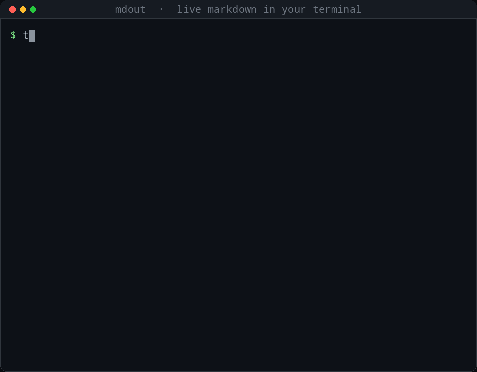

# mdout

> 把管道里的 Markdown 实时渲染成终端文档：流式增量、中文表格对齐、代码高亮，零依赖静态单文件。

**Pipes become documents — rendered as they stream.**

`tail -f` 日志、LLM 流式输出、`cat` 出来的 README……只要往管道里灌 Markdown，`mdout` 就把它**边到边**渲染成终端里漂亮易读的文档——不用等整份文件读完，未写完的段落会就地刷新，写完的块顺势上滚。

```
$ cat notes.md | mdout
$ tail -f agent.log | mdout
$ llm --stream "解释一下 TCP 三次握手" | mdout
```

## 演示

**流式增量渲染** —— 数据边到边显示，未写完的块就地刷新，写完的块顺势上滚：



**常用语法** —— 标题、强调、删除线、行内代码、引用、嵌套列表、代码高亮、链接：


**中英文表格对齐** —— 按显示宽度计算，中文与英文混排、数字列左右对齐都不歪：


> 上图由脚本调用真实的 `mdout` 输出渲染而成，见 `tools/make_demo_gifs.py`。

## 特性

- **流式增量**：稳定块永久提交、未闭合块实时重绘。LLM/日志流不再“憋大招”。
- **中文友好**：表格按显示宽度对齐，简体中文、英文、emoji 混排都不歪。
- **开箱好看**：标题下划线、粗体/斜体/删除线、行内代码、链接、列表/任务列表、引用、围栏代码块 syntect 高亮、GFM 表格与列对齐、水平线。
- **管道友好**：stdout 非 TTY 时自动降级纯文本；`| head` 断管静默退出（exit 0）。
- **零负担**：4 个纯 Rust 依赖，musl 静态单文件约 2.6MB，无 C 依赖；支持 x86_64 / aarch64 Linux。

## 安装

从源码构建：

```bash
git clone git@github.com:sixiaozhe/MDOut.git
cd MDOut
cargo build --release
# 产物：target/release/mdout
```

静态单文件（推荐，零共享库依赖）：

```bash
rustup target add x86_64-unknown-linux-musl
cargo build --release --target x86_64-unknown-linux-musl
# 产物：target/x86_64-unknown-linux-musl/release/mdout
```

aarch64 交叉构建（`.cargo/config.toml` 默认使用 `aarch64-linux-gnu-gcc`）：

```bash
rustup target add aarch64-unknown-linux-musl
cargo build --release --target aarch64-unknown-linux-musl
```

## 用法

```
mdout [--color auto|always|never]   # 默认 auto
      [--width N]                   # 默认自动探测，回退 80
      [--theme NAME]                # syntect 主题，默认 base16-ocean.dark
      [--no-highlight]              # 关闭代码高亮
      [-h|--help] [-V|--version]
```

仅从 stdin 读取。常用示例：

```bash
# 跟随一个持续写入的 Markdown 文件
tail -f notes.md | mdout

# 强制着色并固定 100 列宽
cat doc.md | mdout --color=always --width 100

# 关闭代码高亮（更快、更素）
cat doc.md | mdout --no-highlight
```

颜色策略：`--color always|never` 优先于 `NO_COLOR`；默认 `auto` 时，仅当 stdout 为终端且未设置 `NO_COLOR` 才着色。

## 支持的语法

| 语法 | 渲染 |
| --- | --- |
| 标题 H1 / H2 | 加粗 + `═` / `─` 下划线 |
| 标题 H3–H6 | `###` 前缀 + 加粗着色 |
| 粗体 / 斜体 / 删除线 | ANSI bold / italic / 9 |
| 行内代码 | 反差色 |
| 链接 | `文本 (url)`，URL 暗色 |
| 无序 / 有序 / 任务列表 | `•` / `1.` / `☑` `☐`，支持嵌套与悬挂缩进 |
| 引用 | `│ ` 前缀，按嵌套深度缩进 |
| 围栏代码块 | syntect 语法高亮，整体缩进 4 空格 |
| 表格 | `┌─┬─┐` 边框，`unicode-width` 计算中英文列宽，支持 `:--` `:-:` `--:` 对齐 |
| 水平线 | `─` 铺满宽度 |

## 工作原理

`mdout` 采取**全缓冲重解析 + 稳定区/实时区双区域重绘**：

1. stdin 读取线程按块送入主循环，跨块 UTF-8 断字由增量解码器处理，非法字节 lossy 替换。
2. 每次 tick 对整个缓冲做一次 `pulldown-cmark` 解析并渲染为带 `live` 标记的行。
3. 已确定完成的块作为 **stable** 行永久追加，滚入回滚缓冲；最后一个未闭合块作为 **live** 区，在终端里原地清除重绘。
4. EOF 时收尾提交全部内容；非 TTY 时关闭颜色与重绘，退化为纯文本流。

这样既保留了“整版重解析”的简单正确，又能在最后一个块上做到逐字实时。

## 开发

```bash
cargo test                          # 单元 + 集成测试
cargo clippy --all-targets -- -D warnings
```

模块划分：`cli`（参数）、`input`（增量 UTF-8 读取）、`parser`（cmark 配置）、`renderer`（纯函数渲染）、`terminal`（宽度/提交/重绘）、`app`（去抖事件循环）、`main`（装配）。

设计文档与实现计划见：

- `docs/superpowers/specs/2026-09-25-md-stream-renderer-design.md`
- `docs/superpowers/plans/2026-09-25-mdout-implementation.md`
